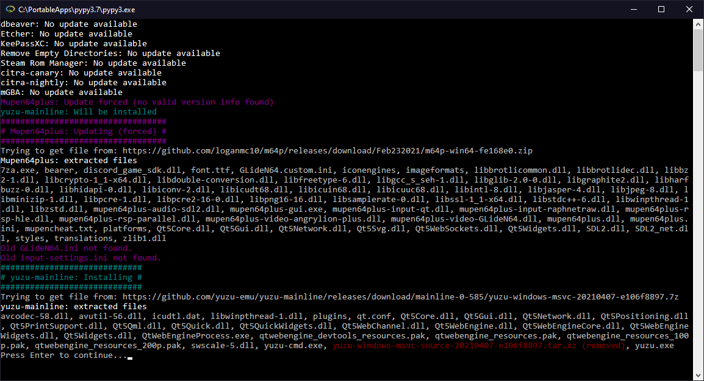

# Superelixier Updater

 

**Using this tool currently requires editing of TOML files
([Tom's Obvious, Minimal Language](https://en.wikipedia.org/wiki/TOML)). This is very similar to an  INI file.** If you
want to wait for a more user-friendly version, select ``Watch -> Custom -> Releases`` from the top of the GitHub
repository.

In any case, check out the [list of Pre-configured Apps](./docs/Available%20Apps.md) or (if regex knowledge available) [find out how to add your favorite app.](./docs/Adding%20Apps.md)

Superelixier Updater can automatically update a number of apps provided in portable form. Currently, it handles apps
distributed on Appveyor, GitHub and HTML pages.

### Requirements

- Windows 10+ 64-Bit

## Usage

You can 
- use this as *one-click updater*
- (and/or) use the *command-line interface*

### One-click update setup

- Download and extract the latest preview release.
- Set up the configuration file in the ``config`` folder of the updater:
    ``local.toml`` tells the tool where to install which app. Rename the ``local_example.toml`` to ``local.toml`` and
    set your options. Make sure you use forward slashes in your paths.

    The one-click update can be run from a USB stick. To configure this, leave out the drive letter, i.e. use ``/portable``
    instead of ``D:/portable``.

- **DISCLAIMER: This software is provided as-is without absolutely any warranty. Use this at your own risk.**
    - This reminder is necessary because a bad configuration could lead to unexpected behavior. In case anything goes
      wrong, you'll have your previous files in a folder ``.superelixier-history`` that sits in the app's directory. As
      of now, the updater doesn't delete any of your old files at all: everything goes into the history folder instead.
- If your configuration is set up, you run the ``superelixier.exe`` file to run the updater.

### Command-line interface
Various commands are available.
To install an app: 
>>> superelixier.exe install goat-app

To update (or install):
>>> superelixier.exe install -U goat-app

See what else is available:
>>> superelixier.exe list

### Authentication (optional)
GitHub authentication tokens can be configured in the file ``config/auth.toml``. This will be auto-created
if it's missing. Most users don't need to change anything here, as modest amounts of API calls can be done without
authentication.

## Features

- No unnecessary downloads: Checks the installed app for update and only downloads releases if there is a new one. Let's
  not waste bandwidth (caveat: only detects updates it did itself).
- Running detection: Downloaded updates will be applied next run if the folder was in use this run.
- Extensible: Add more apps via configuration files.
    - Release files detected via regular expression.
    - Can specify files that should be deleted from release (for files you do not need)
    - Can specify any files or folders that should be protected from being replaced by updates.

## Planned
Planned features are tracked via [labeled GitHub Issues](https://github.com/FlotterCodername/superelixier-updater/issues?q=is%3Aopen+is%3Aissue+label%3Aaccepted+label%3Aepic%2Cenhancement).
